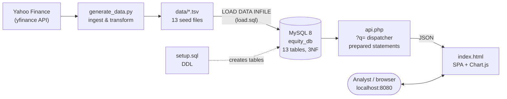
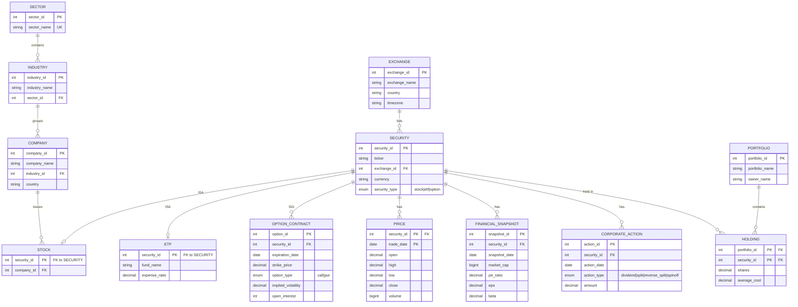

# Equity Market Intelligence & Portfolio Analysis Database

**A normalized MySQL 8 warehouse of real equity-market data (prices, fundamentals, options, and corporate actions) fronted by a zero-framework PHP analytics API and a single-page SQL explorer.**

Pull daily OHLCV, fundamentals, options, and dividend/split history for 25 large-cap
companies plus 5 ETFs from Yahoo Finance, model it in a fully-normalized (3NF)
relational schema with a proper ISA hierarchy for securities, and slice it through 15
finance-grade analytics queries — rolling volatility, sector-relative returns, implied
volatility term structure, dividend yield, EPS-growth streaks, and market-cap tiers —
all rendered live in the browser with the underlying SQL on display.

---

## Highlights

- **Real market data, reproducibly ingested.** `generate_data.py` pulls prices,
  fundamentals, options chains, and corporate actions from Yahoo Finance (`yfinance`)
  and emits clean, load-ready `data/*.tsv` files — with hard-coded fallbacks so the
  pipeline still produces a complete dataset when the API is rate-limited or offline.
- **Textbook-correct relational modeling.** 13 tables in **3rd Normal Form**, with a
  documented ISA (is-a) hierarchy — `Security` ⟶ `Stock` / `ETF` / `Option_Contract` —
  implemented via the separate-table approach to avoid NULL sprawl. See
  [`schema_document.md`](schema_document.md) for the full FD analysis and 3NF proof.
- **Finance-grade analytics in pure SQL.** Window functions (`LAG`, `STDDEV_SAMP` over
  rolling frames), CTEs, correlated subqueries for as-of joins, and annualization by
  `√252` — 15 queries spanning single-security and cross-sector analysis.
- **Parameterized, injection-safe API.** [`api.php`](api.php) exposes every query
  through a single `?q=` dispatcher using prepared statements and bound parameters.
- **Self-documenting UI.** [`index.html`](index.html) is a dependency-light single-page
  app (only Chart.js) that shows the exact SQL for each analysis, renders results as
  sortable tables, and toggles to charts — no build step.
- **One-command startup.** `docker compose up --build` brings up MySQL + PHP, loads the
  schema and seed data, and serves the explorer at <http://localhost:8080>.

---

## Architecture



**Flow:** Yahoo Finance → `generate_data.py` → `data/*.tsv` → **MySQL 8** → `api.php` → `index.html`.

---

## Data model

Thirteen tables in 3NF. `Security` is the parent of an ISA hierarchy whose subtypes —
`Stock`, `ETF`, and `Option_Contract` — each key off `security_id`. Prices, fundamentals,
corporate actions, and portfolio holdings all hang off `Security`.



Full functional-dependency analysis, candidate keys, and the 3NF proof for every table
live in [`schema_document.md`](schema_document.md).

---

## Quickstart (Docker)

**Prerequisites:** Docker + Docker Compose.

```bash
git clone <your-fork-url> equity-db
cd equity-db

# Bring up MySQL 8 + PHP, apply the schema, load the seed TSVs, and serve the app.
docker compose up --build
```

Then open **<http://localhost:8080>** — pick an analysis from the sidebar, choose a
ticker or sector, and hit **Run**. Click **show** on the SQL panel to see the exact
query, and **Chart** to visualize the result.

The stack reads its database connection from environment variables
(`DB_HOST`, `DB_NAME`, `DB_USER`, `DB_PASS`); defaults target the bundled MySQL service
and the `equity_db` database. Copy `.env.example` to `.env` to override them.

---

## Query catalog

Every analysis is a single `GET api.php?q=<id>` call. `s*` endpoints are
single-security ("Stock" mode); `r*` endpoints are cross-sector ("Sector" mode). All
inputs are bound via prepared statements.

| `q` | Analysis | Params | Key SQL technique |
|-----|----------|--------|-------------------|
| `sectors` | List distinct sector names (populates the UI dropdown) | — | `SELECT … ORDER BY` |
| `s1` | Daily close price & daily return | `ticker`, `start`, `end` | `LAG` window function |
| `s2` | 30-day rolling **annualized volatility** | `ticker`, `start`, `end` | `STDDEV_SAMP` over rolling 30-row frame × `√252` |
| `s3` | Options-chain **implied volatility** by expiration & type | `ticker` | `GROUP BY` on `Option_Contract`, avg IV / total OI |
| `s4` | Corporate actions with price impact (−7d / +7d) | `ticker` | Correlated as-of subqueries, `LEFT JOIN` |
| `s5` | Total stock return **vs. SPY** (excess return) | `ticker`, `start`, `end` | As-of first/last price joins, benchmark diff |
| `s6` | Financial-snapshot trend (P/E, EPS, beta, mkt cap) | `ticker` | Time-series `JOIN` on `Financial_Snapshot` |
| `r1` | Average sector return **vs. SPY** | `start`, `end` | Sector aggregation + benchmark-relative return |
| `r2` | Average trailing **P/E by industry** in a sector | `sector` | Latest-snapshot subquery, `AVG` grouping |
| `r3` | Companies with ≥ N consecutive **EPS-growth** quarters | `sector`, `min_q` | Two-stage CTE, windowed streak count |
| `r4` | **Top 10 most volatile** stocks in a sector | `sector`, `start`, `end` | Per-security `LAG` returns, `STDDEV_SAMP`, `LIMIT` |
| `r5` | Companies trading **below industry-average P/E** | — | Correlated subquery vs. industry mean |
| `r6` | **Top dividend-yield** stocks in a sector | `sector` | Trailing-12m dividend sum ÷ latest close |
| `r7` | **Market-cap tier** distribution in a sector | `sector` | `CASE` bucketing (Mega/Large/Mid/Small) |
| `r8` | **Beta** dispersion (avg/min/max) by industry | `sector` | Latest-snapshot aggregation |
| `r9` | **Top 10 volume leaders** in a sector | `sector`, `start`, `end` | `AVG(volume)` grouping, `LIMIT` |

**Shared parameter defaults:** `ticker=AAPL`, `start=2024-01-01`, `end=today`,
`min_q=4` (clamped ≥ 1). `sector` accepts any name from the `sectors` endpoint.

---

## Tech stack

| Layer | Technology | Notes |
|-------|-----------|-------|
| Database | **MySQL 8** | Window functions, CTEs, `ENUM`, `CHECK` constraints |
| Ingestion | **Python 3** + `yfinance`, `pandas` | `generate_data.py` → `data/*.tsv` |
| Loading | **SQL** (`setup.sql`, `load.sql`) | DDL + `LOAD DATA INFILE` bulk load |
| API | **PHP 8** (`mysqli`) | Single-file `?q=` dispatcher, prepared statements |
| Frontend | **Vanilla JS + Chart.js** | No build step; SQL-on-display SPA |
| Orchestration | **Docker Compose** | MySQL + PHP, one command |

---

## Repository layout

```
equity-db/
├── index.html          # Single-page analytics explorer (was db_finalProject.html)
├── api.php             # ?q= query dispatcher (prepared statements → JSON)
├── config.php          # DB connection (reads DB_HOST/DB_NAME/DB_USER/DB_PASS)
├── setup.sql           # DDL — creates all 13 tables (3NF)
├── load.sql            # Bulk-loads data/*.tsv via LOAD DATA INFILE
├── cleanup.sql         # Drops tables (teardown)
├── queries.sql         # Standalone reference copies of the 15 analytics queries
├── generate_data.py    # Yahoo Finance → data/*.tsv ingestion pipeline
├── schema_document.md  # Schema design: FD analysis + 3NF proof
├── process.txt         # Project notes / methodology
└── data/               # 13 seed TSVs (sector, industry, company, price, …)
```

---

## Manual setup (without Docker)

If you'd rather run against an existing MySQL 8 instance:

```bash
# 1. Create the database and schema
mysql -u <user> -p -e "CREATE DATABASE equity_db;"
mysql -u <user> -p equity_db < setup.sql

# 2. (Optional) regenerate the seed data from Yahoo Finance
python3 -m pip install yfinance pandas
python3 generate_data.py            # writes data/*.tsv

# 3. Load the seed data
#    Requires LOAD DATA LOCAL INFILE to be enabled on client & server.
mysql --local-infile=1 -u <user> -p equity_db < load.sql

# 4. Point the API at your database
#    Set DB_HOST / DB_NAME / DB_USER / DB_PASS in your environment (or config.php),
#    then serve the directory with PHP:
php -S localhost:8080
```

Open <http://localhost:8080/index.html>. To tear everything down, run
`mysql -u <user> -p equity_db < cleanup.sql`.

---

## License

Released under the [MIT License](LICENSE).
